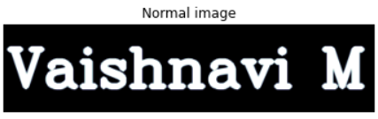
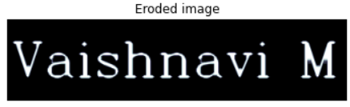
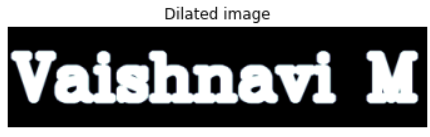

# Implementation-of-Erosion-and-Dilation
## Aim
To implement Erosion and Dilation using Python and OpenCV.
## Software Required
1. Anaconda - Python 3.7
2. OpenCV
## Algorithm:
### Step1:
Import the necessary packages.
### Step2:
Create the text image using cv2.putText.
### Step3:
Then create the structuring image for dilation/erosion.
### Step4:
Apply erosion and dilation using cv2.erode and cv2.dilate.
### Step5:
Plot the images using plt.imshow.
## Program:

``` Python
# Import the necessary packages
import cv2
import numpy as np
import matplotlib.pyplot as plt
# Create the Text using cv2.putText
image=np.zeros((100,420),dtype='uint8')
font=cv2.FONT_HERSHEY_SIMPLEX=3
cv2.putText(image,'Vaishnavi M',(5,70),font,2,(255),5,cv2.LINE_AA)
plt.title('Normal image')
plt.imshow(image,'bone')
plt.axis('off')
# Create the structuring element
kernal=np.ones((5,5),np.uint8)
# Erode the image
erotion=cv2.erode(image,kernal)
plt.title('Eroded image')
plt.imshow(erotion,'bone')
plt.axis('off')
# Dilate the image
erotion=cv2.dilate(image,kernal)
plt.title('Dilated image')
plt.imshow(erotion,'bone')
plt.axis('off')
```
## Output:

### Display the input Image


### Display the Eroded Image


### Display the Dilated Image


## Result
Thus the generated text image is eroded and dilated using python and OpenCV.
